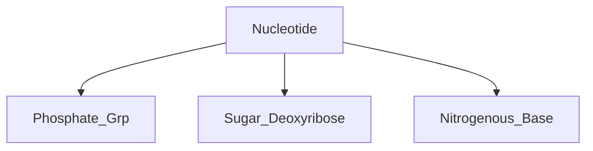

#### Basic Units of DNA
- Basic Unit of DNA is called *nucleotide*
Each nucleotide is made up of:

##### Nitrogenous Bases
4 Different Nitrogenous bases
- Adenine (A)
- Cytosine (C)
- Guanine (G)
- Thymine (T)
![[Pasted image 20250306210240.png|400]]
___
##### Putting Nucleotides Together
Sugar, Phosphate group, One of the 4 bases can combine to form a *nucleotide* as shown below.
>[!important]
>Nucleotides are the building blocks of DNA
>Phosphate grp + deoxyribose + nitrogen containing base = nucleotide

![[Pasted image 20250306210322.png|400]]
nucleotides can be joined together to form long chains -> called *polynucleotides*
![[Pasted image 20250306210400.png|400]] ^7e422f

Each Gene -> made up of a sequence of Nucleotides. Sequence of Nucleotides (bases) can vary.
- this results in many different genes
Refer to [[What Are Genes]]

>[!note]
>since there are 4 diff nucleotides, then a gene of n number of nucleotides will have $4^n$ different combinations

___
##### Rule of Base Pairing
DNA molecule -> made up of 2 polynucleotide chains
Sugar-phosphate backbone -> found on the outside of DNA molecule, while bases are found on the inside of DNA molecule.
Bases of one chain are bonded to those of the opposite chain according to *rule of base pairing*

- Adenine (A) is bonded to Thymine(T)
- Cytosine(C) is bonded to Guanine(G)

-> called *complementary base pairing* -> because A has shape complementary to that of T and C has shape complementary to that of G
- complementary bases are held by **hydrogen bonds**
![[Pasted image 20250306210658.png|550]]
___
In DNA molecule: ratio of adenine to thymine (A:T) and cytosine to guanine (C:G) are ALWAYS 1:1 
___
