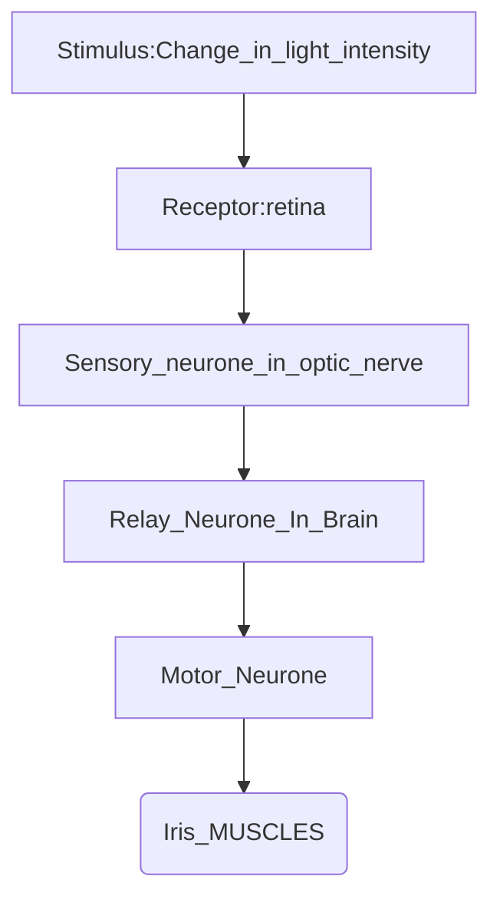

![[Pasted image 20241113221344.png]]

| Part                      | Function                                                                                                                                                                                                                                                                                                                                                                                                                                                                                                                                                                                                                                                                                                                                                                                                                                                                                                                                                                                                                                                                            |
| ------------------------- | ----------------------------------------------------------------------------------------------------------------------------------------------------------------------------------------------------------------------------------------------------------------------------------------------------------------------------------------------------------------------------------------------------------------------------------------------------------------------------------------------------------------------------------------------------------------------------------------------------------------------------------------------------------------------------------------------------------------------------------------------------------------------------------------------------------------------------------------------------------------------------------------------------------------------------------------------------------------------------------------------------------------------------------------------------------------------------------- |
| Retina                    | Innermost Layer of the eyeball. -> multi layered sensory tissue that lines back of the eye -> it is the light-sensitive layer on which images are formed.  -> contains millions of *photoreceptors* -> capture light rays and convert them into electrical impulses -> transmitted to brain -> Photoreceptors are connected to the nerve endings from the optic nerve -> impulses travel along optic nerve to the brain where they are turned into images.  - there are 2 types of photoreceptors in retina: rods and cones.   **Cones:** - 6 million cones -> contained in macula -> portion of the retina responsible for central vision ) -> cones are most densely packed within fovea centralis -> very centre portion of the macula. - cones function best in bright light and allow us to appreciate colour (3 types of cones, red, blue, green)  **Rods:** - approx 125 million rods -> spread throughout the peripheral retina and function best in dim lighting.  -> rods are responsible for peripheral and night vision |
| Lens                      | Transparent, circular, biconvex structure.  -> elastic + changes its shape or thickness to focus light onto the retina -> edge attached to ciliary body by (suspensory) ligaments.                                                                                                                                                                                                                                                                                                                                                                                                                                                                                                                                                                                                                                                                                                                                                                                                                                                                                            |
| Blind Spot                | Region where optic nerve leaves the eye.  -> does not contain any rods or cones; therefore it is not sensitive to light. (no photoreceptors) -> you will not be able to see any image if it falls on this blind spot (although images are still formed)                                                                                                                                                                                                                                                                                                                                                                                                                                                                                                                                                                                                                                                                                                                                                                                                                       |
| Optic Nerve               | Nerve that transmits nerve impulses to the brain when the photoreceptors in the retina are stimulated. - transmits nerve impulses from photoreceptors to brain                                                                                                                                                                                                                                                                                                                                                                                                                                                                                                                                                                                                                                                                                                                                                                                                                                                                                                                   |
| Fovea                     | Small yellow depression in the retina.  -> situated directly behind the lens.  -> this is where images are normally focused.  Fovea contains the greatest concentration of photoreceptors (cones, but no rods)  Fovea -> enables a person to have detailed colour vision -> in bright light.                                                                                                                                                                                                                                                                                                                                                                                                                                                                                                                                                                                                                                                                                                                                                                            |
| Vitreous chamber (humour) | Space behind the lens.  -> gives eye form and shape.  -> filled with vitreous humour -> transparent, jelly-like substance.  Vitreous humour -> keeps eyeball firm and helps to refract light onto the retina                                                                                                                                                                                                                                                                                                                                                                                                                                                                                                                                                                                                                                                                                                                                                                                                                                                               |
| Choroid                   | Middle layer of the eyeball (between sclera and the retina).  It has 2 functions: - Pigmented black to prevent internal reflection of light - Contains network of blood vessels that bring oxygen and nutrients to the eyeball and remove metabolic waste products.                                                                                                                                                                                                                                                                                                                                                                                                                                                                                                                                                                                                                                                                                                                                                                                                        |
| Ciliary Body              | Thickened region at the front end of the choroid. -> contains ciliary muscles -> control the curvature or thickness of the lens. -> ciliary muscles -> are involuntary -> around lens to enable lens to change its shape by contracting and relaxing.  - production of aqueous humour.                                                                                                                                                                                                                                                                                                                                                                                                                                                                                                                                                                                                                                                                                                                                                                                     |
| Suspensory Ligament       | Connective tissue that attaches the edge of the lens to ciliary body. - holds lens in place and attach it to ciliary muscles.                                                                                                                                                                                                                                                                                                                                                                                                                                                                                                                                                                                                                                                                                                                                                                                                                                                                                                                                                    |
| Cornea                    | Dome-Shaped transparent layer -> continuous with sclera   -> It refracts light rays into the eye.  -> Cornea causes the greatest refraction of light into eye.  - no blood vessels in cornea -> thus clear and shiny surface - extremely sensitive (most amt of nerve endings)                                                                                                                                                                                                                                                                                                                                                                                                                                                                                                                                                                                                                                                                                                                                                                                       |
| Aqueous Chamber (humour)  | - Lens divides eyeballs into 2 chambers -> smaller chamber in front of iris and lens -> filled with aqueous humour.  It is the space between the lens and the cornea.  -> filled with aqueous humour -> a transparent, watery liquid -> nourishes the cornea and lens and gives front of eye its form and shape.   Aqueous humour keeps the front of the eyeball firms and helps to refract light into the pupil.                                                                                                                                                                                                                                                                                                                                                                                                                                                                                                                                                                                                                                                 |
|                           |                                                                                                                                                                                                                                                                                                                                                                                                                                                                                                                                                                                                                                                                                                                                                                                                                                                                                                                                                                                                                                                                                     |
___
#### Pupil Reflex
In order for a person to see clearly -> only the right amount of light should enter the eye.
For example: more light must enter the eye in dim light.
Size of pupil -> determines how much light enters the eye.

*Pupil Reflex* is a *reflex action.* (cranial reflex)
Pupil -> changes in size in response to changes in light intensity. This is controlled by the Iris.
![[Pasted image 20241113223559.png|500]]

Pupil reflex is beneficial to the eyes in the following ways:
1. it is automatic, so no learning is required
2. it prevents excessive light from entering the eye and damaging retina
3. it is an immediate response
4. allows enough light to enter the eye to allow us to see CLEARLY 
___
#### How Does the Iris Control the Amount of Light Entering the Eye
Size of the pupil -> is controlled by 2 sets of involuntary muscles -> in the iris.
These are the circular muscles and the radial muscles. 
- circular muscles are arranged in a circle around the pupil 
- While the radial muscles are arranged radially

Circular and radial muscles -> are called antagonistic muscles -> because when one set contracts, the other set relaxes. 
![[Pasted image 20241113224329.png|600]]
![[Pasted image 20241113224359.png|600]]
(recall: in any reflex action -> there must be a receptor and an effector)
(in the pupil reflex -> receptors are found in the retina, and the effector is the iris)
![[Pasted image 20241113224518.png|800]]
*pathway of nerve impulses in the pupil reflex can be summarised as follows*

[[Reflex Action (Involuntary Actions)]]
___
>[!sample]
>MUST MEMORISE
>
>Involuntary action -> describe changes that occur in the eye when light becomes bright. 
>- Photoreceptors (cones) in the retina are stimulated by high light intensity 
>- Sensory neurone in the optic nerve -> transmits nerve impulses to the brain
>- In the brain -> nerve impulses are transmitted across a synapse to a relay neurone IN THE BRAIN (as this is a cranial reflex), and then across another synapse to the motor neurone. 
>- The motor neurone transmits nerve impulses from the brain to the iris
>- circular muscles of the iris contract + radial muscles relax
>- the diameter of the pupil becomes smaller/ constricts -> reducing the amount of light entering the eye. (prevents damaging retina)

- considered a cranial reflex
___

