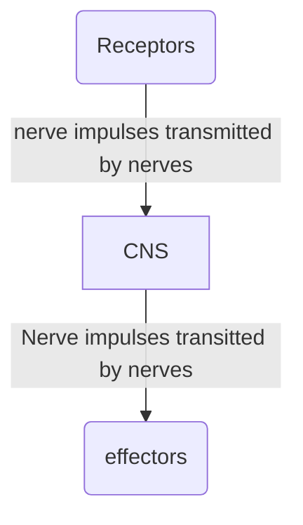

Made up of Following:
- Central nervous system (CNS) consisting of:
	- brain 
	- spinal cord. 
>[!understanding]
>Function of CNS: process and interpret sensory info, controls responses and decision making, coordinates body functions. (for understanding ONLY)

- Peripheral nervous system (PNS) consisting of: 
	- cranial nerves (from brain)
	- spinal nerves (from the spinal chord)
	- sense organs
>[!understanding]
>transmits signals between CNS and rest of body. 

>[!note]
>Nerves transmit or carry impulses from receptors to relay Neurones in the central nervous system and from there to the effectors. 

Sense organs receive stimuli through receptors found in them.
- They inform central nervous system of any change in the surroundings, by producing *electrical signals* or messages -> *nerve impulses.*
- These nerve impulses -> carried or *transmitted* to the Central nervous system by *nerves* (cranial nerves and spinal nerves)
- Nerve impulse -> transmitted -> fraction of a second

Example:
1. when person touches your hand, you feel it almost immediately
2. In response to this stimulus, central nervous system will send nerve impulses to the muscles
3. The muscles will then effect an action. For example; muscles in hand might contract, and the hand is jerked away. Therefore, muscles are known as *effectors*
___
Nerves transmit nerve impulses from the receptors to the central nervous system, and from there to the effectors.
![[Screenshot 2024-11-06 at 10.43.17 AM.png|500]]
(nervous system is a device for gathering, transmitting, and interpreting information)
___
### Neurones
[[Neurones]]
 