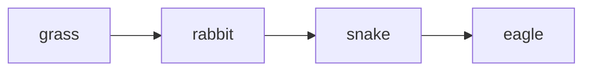

Allows us to compare *mass of organisms* present in each trophic level <mark style="background: #FFF3A3A6;">at particular time.</mark>

##### How is Pyramid of Biomass Constructed?
Constructed based on standing mass -- and *dry mass* of organisms -> in each trophic level -> at *any one time* 
- Dry mass of organism -> is mass of organism when all its water has been removed

Consider food chain: 

-> biomass of lower trophic level -> larger than biomass of next trophic level
![[Screenshot 2025-01-23 at 10.13.14 AM.png|300]]
___
###### What are Some Reasons for and Limitations of Using a Pyramid of Biomass to Represent Food Chain?

| Reasons                                                                                                                                          | Limitations                                         |
| ------------------------------------------------------------------------------------------------------------------------------------------------ | --------------------------------------------------- |
| Considers size and mass of organisms.  -> thus it is more accurate representation of energy flow through food chain than a pyramid of numbers | Organisms have to be killed to obtain biomass       |
|                                                                                                                                                  | Has to be constructed at a particular point in time |
____
>[!sample]
>Explain how organisms in first trophic level of xxx food chain produce biomass using energy from sun
>- Biomass is produced via photosynthesis
>- Where chlorophyll absorbs light energy and is converted into chemical energy in glucose molecules
>- Glucose molecules can then be converted into other organic compounds such as starch and cellulose (which forms the biomass of the organism)

>[!sample]
>Explain why 4th trophic level has least biomass in this food chain
1 energy is passed from one trophic level to the next via feeding ;
2 the amount of energy available at each successive trophic level decreases
as only 10% of energy gets transferred to the next trophic level ;
3 the rest of the energy is lost to the environment as heat through respiration/
uneaten parts / dead bodies / faeces / excretory products ;
4 the energy lost to the environment cannot return into the same system /
cannot be recycled in the system
5 since the last trophic level receives the least energy, there is the least
amount of energy available to carry out metabolic process like growth to
increase biomass ;

