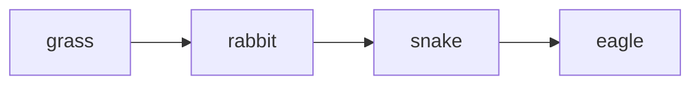

Allows us to compare number of organisms present in each trophic level ><mark style="background: #FFF3A3A6;"> at particular time</mark>

##### How is it Constructed
Consider food chain: 

Suppose that: 
- Ten eagles in given area -> each eagle needs to find 1 snake every day.
	- Month -> 10 eagles need 300 snakes to keep them alive
- Snake -> eats 2 rabbits a day. 300 snakes -> need 18 000 rabbits in month
- Each rabbit eats 15 grass plants daily. 18000 rabbits -> need about 8 100 000 grass plants in month

Number of organisms in Each trophic level -> can be used to construct pyramid of numbers.
- Length of bar in pyramid -> represents number of organisms present at that time
![[Screenshot 2025-01-23 at 10.08.22 AM.png|400]]
___
###### Limitations Of Using Pyramid of Numbers to Represent Food Chain
- Does not consider size and mass of organisms
- Does not consider whether organism is adult or juvenile
___
