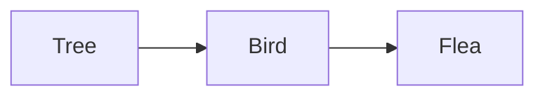

Most ecological pyramid -> pyramid-shape but there are exceptions: 

Pyramid of Numbers May be upside down / inverted if: 
- Organisms of one trophic level -> are parasitic on organisms of another trophic level
- Many small organisms -> of 1 trophic level -> feed on a large organism of another trophic level
___
Consider Food Chain:

____
Pyramid of numbers is inverted.
- Bottom of pyramid is represented by only 1 tree. 
- Many birds feed on tree
- Many fleas are parasitic on birds. 

Pyramid of Biomass remains broad at bottom and narrow towards top
- One tree has comparatively higher biomass to support the other populations
___
![[Screenshot 2025-01-23 at 10.21.47 AM.png|400]]
___
![[Screenshot 2025-01-23 at 10.22.24 AM.png]]
___
