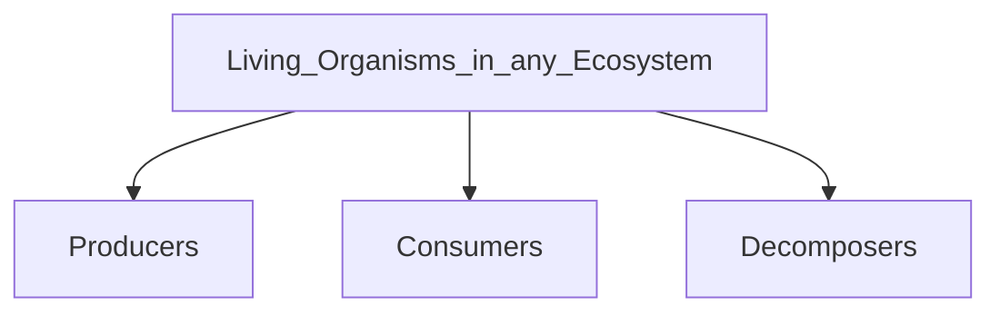

- Energy + Nutrients -> transferred from producers to consumers to decomposers through feeding

| Producers                                                                                                                                                                                                                             | Consumers                                                                                                                                                                                                                                                                                                                                                                     | Decomposers                                                                                                                                                                |
| ------------------------------------------------------------------------------------------------------------------------------------------------------------------------------------------------------------------------------------- | ----------------------------------------------------------------------------------------------------------------------------------------------------------------------------------------------------------------------------------------------------------------------------------------------------------------------------------------------------------------------------- | -------------------------------------------------------------------------------------------------------------------------------------------------------------------------- |
| Producer -> organism that *makes its own food* - contains chlorophyll -> absorbs light to convert $CO_2$ and water into glucose -> photosynthesis - Glucose -> chemical store of energy - Oxygen is released in the process. | - not able to make their own food - obtain energy + nutrients -> by feeding on other organisms.  - classified as -> primary, secondary, tertiary -> according to position in food chain.   **Primary Consumers:** feed on plants only **Secondary Consumers:** feed on primary consumers **Tertiary Consumers:** organisms that feed on secondary consumers | - organisms that get their energy by breaking down dead organisms, faeces, excretory products.   -> activities return mineral salts + nutrients -> back to env.   |

| Population                                                        | Community                                                                                  | Ecosystem                                                                     |
| ----------------------------------------------------------------- | ------------------------------------------------------------------------------------------ | ----------------------------------------------------------------------------- |
| group of organisms -> of same species -> live together in habitat | - made up of all pop. of diff. species living + interacting with one another in a habitat. | Community of organisms -> interacting with one another + its non living env.  |
___
## Energy Flow in Ecosystem
[[Energy Flow in Ecosystem]]
___
## Ecological Pyramids
[[Ecological Pyramids]]
___
## How are Nutrients Recycled Through An Ecosystem
[[How are Nutrients Recycled Through Ecosystem]]
___
## Carbon Sinks
[[Carbon Sinks]]
___
## How do We Affect the Ecosystem
[[How Do We Affect the Ecosystem]]
___
## Need for Conservation
[[Need for Conservation]]
___
![[Pasted image 20250310212316.png]]

>[!sample]
>env consequence of replacing 1 tree species with another
>- plant biodiversity drop
>- gene pool shrink + causes plant and animal to be less adaptable to env changes
>- extinction for some species

