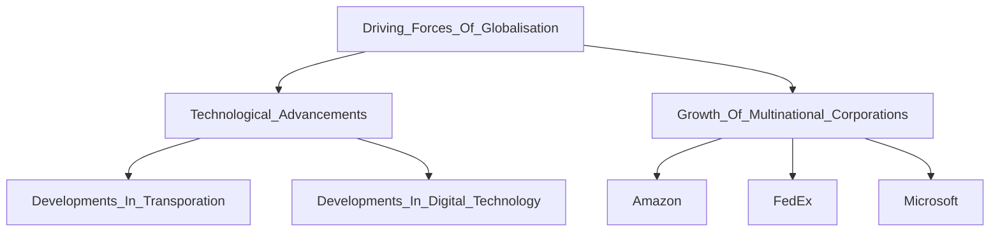

___
2 driving forces have helped to contribute to globalisation:
- technological advancements in transportation and digital technology
- growth of multinational corporations (MNCs)

>[!definition]
>Globalisation refers to the process through which ideas and activities of different people living in different parts of the world become interconnected
> #SocialStudiesDefinitions 
> >[!definition]
> >These **Interconnections** are links created or established among people, businesses, and countries through the movement of goods, services, people, knowledge and resources
> 
> >[!definition]
> >Such interconnections can lead to **Interdependence** where developments in the world (global) and developments in a specific place (local) affect one another. In other words, events in one part of the world may affect other parts of the world
> 
> 
> 

Interconnections and Interdependence relationships in a globalised world are seen in the *production of iPhones*
ADDD IMAGE HERE
___
Globalisation is certainly not new.
*Movement of goods, services, knowledge, ideas* across all continents took place even in 19th century.
- E.g. products from Britain like iron, textiles, manufactured goods were exported all over the world

However globalisation has been accelerating - causing world to become *increasingly interconnected and interdependent* 

**2 Key Forces driving globalisation:**

 ___
### Technological Advancements
[[Technological Advancements]]
____
### Growth of Multinational Corporations
[[Growth of Multinational Corporations]]
___

**Technological Advancements and Growth of MNCs can reinforce each other in driving globalisation around the world**

| Technological Advancements                                                                                                                                                          | Growth of MNCs                                                                                                                                                                                                     |
| ----------------------------------------------------------------------------------------------------------------------------------------------------------------------------------- | ------------------------------------------------------------------------------------------------------------------------------------------------------------------------------------------------------------------ |
| Developments in modes of land, sea and air transportation enable MNCs to move people, goods and services around world in larger volumes quickly and at lower costs                  | Need of MNCs to move their goods efficiently provides incentive for developments in transportation.  Countries also continually develop and improve their transport infrastructure and services to attract MNCs |
| Developments in Digital technology have led to more efficient and reliable long distance communications across borders and time zones, facilitating the business activities of MNCs | The need for reliable communication tools to coordinate MNCs' business activities across globe encourages developments in digital technology                                                                       |
___
