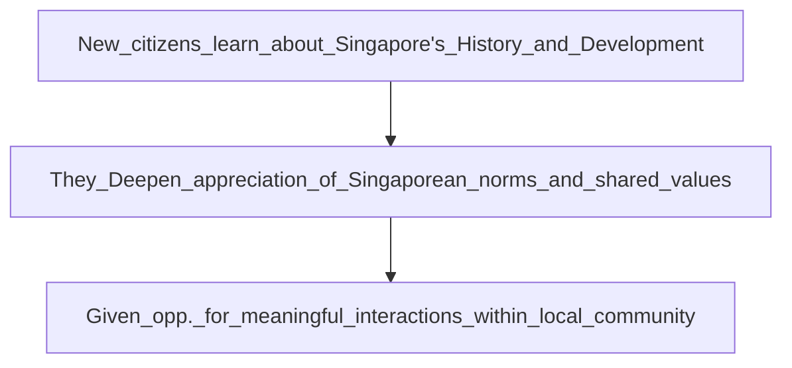

Upon approval -> for Singapore citizenship -> new citizens undergo compulsory programme -> **Singapore Citizenship Journey** 
- collaborative effort -> between ministry of culture, community, and Youth, Immigration and Checkpoints authority, and People's association
___

- they receive Singapore Citizen certificates ->at citizenship ceremony -> after completing program
___
